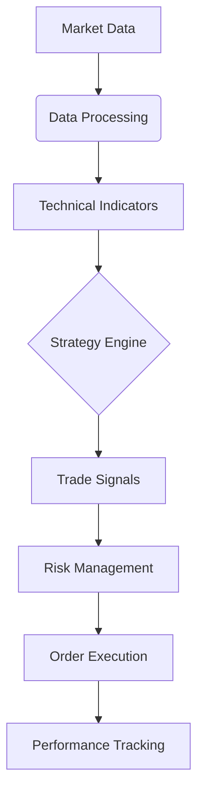

# Roostoo Trading Bot - Advanced Cryptocurrency Trading Simulator


## 🔍 Overview
The Roostoo Trading Bot is a sophisticated algorithmic trading system designed for cryptocurrency markets. It provides a complete simulation environment using the Roostoo mock API (https://mock-api.roostoo.com) to test and refine trading strategies with real-market conditions without financial risk.

## ✨ Key Features
### Core Capabilities
- **Realistic Market Simulation**: Full integration with Roostoo's mock trading API
- **Multi-Strategy Framework**: Simultaneously runs and evaluates multiple trading approaches
- **Comprehensive Technical Analysis**: Advanced indicator integration through TA-Lib

### Trading Strategies
| Strategy | Indicators Used | Description |
|----------|-----------------|-------------|
| Mean Reversion | SMA, Z-Score | Capitalizes on price deviations from historical mean |
| MACD Crossover | MACD, Signal Line | Identifies trend changes using moving average convergence |
| RSI Composite | RSI, Stochastic | Combines momentum indicators for confirmation |
| Bollinger Strategy | BBands, RSI | Uses volatility bands with momentum confirmation |
| Combined Signals | MACD+RSI+BBands | Requires multi-indicator consensus |

### Risk Management System
- Dynamic position sizing (1-5% of portfolio)
- Automatic stop-loss (3%) and take-profit (6%) placement
- Maximum concurrent positions limit (5 assets)
- Volatility-adjusted trade sizing

## 🛠 Technical Implementation


## 🚀 Getting Started

### Prerequisites
- Python 3.8+ (recommended: 3.10)
- TA-Lib (see [installation guide](https://github.com/TA-Lib/ta-lib-python))
- Roostoo API keys (free from [roostoo.com](https://roostoo.com))

### Installation
```bash
# Clone repository
git clone https://github.com/AbhivirSingh/Roostoo-Trading-Bot.git
cd Roostoo-Trading-Bot

# Create virtual environment
python -m venv .venv
source .venv/bin/activate  # Linux/Mac
# .venv\Scripts\activate  # Windows

# Install dependencies
pip install -r requirements.txt
```

### Configuration
Edit `config.py`:
```python
API_KEY = "your_roostoo_api_key"
SECRET_KEY = "your_roostoo_secret"
```

## 🏃 Running the Bot
```bash
python trading_bot.py --strategy combined --interval 15m
```

### Command Line Options
| Parameter | Description | Default |
|-----------|-------------|---------|
| `--strategy` | Strategy to use (combined, macd, rsi, etc.) | `combined` |
| `--interval` | Trading interval (1m, 5m, 15m, 1h) | `15m` |
| `--risk` | Risk level (1-5) | `3` |
| `--max-trades` | Maximum concurrent trades | `5` |

## 📊 Performance Monitoring
The bot generates three types of output:
1. **Console Logs**: Real-time trading activity
2. **Trade Logs**: Detailed CSV records of all trades
3. **Performance Reports**: Summary statistics including:
   - Win rate
   - Profit factor
   - Sharpe ratio
   - Maximum drawdown

## 📂 Project Structure
```
Roostoo-Trading-Bot/
├── core/
│   ├── strategy.py       # Strategy implementations
│   ├── risk_manager.py   # Risk management system
│   └── data_handler.py   # Market data processing
├── utils/
│   ├── logger.py         # Logging system
│   └── helpers.py        # Utility functions
├── config.py            # Configuration settings
├── trading_bot.py       # Main application
└── requirements.txt     # Dependencies
```

## 🔧 Customization Options
### Strategy Parameters
```python
# In strategy.py
STRATEGY_PARAMS = {
    'rsi': {
        'overbought': 70,
        'oversold': 30,
        'period': 14
    },
    'macd': {
        'fast_period': 12,
        'slow_period': 26,
        'signal_period': 9
    }
}
```

### Risk Parameters
```python
# In risk_manager.py
RISK_PROFILES = {
    'conservative': {
        'max_position': 0.03,
        'stop_loss': 0.02,
        'take_profit': 0.04
    },
    'aggressive': {
        'max_position': 0.1,
        'stop_loss': 0.05,
        'take_profit': 0.1
    }
}
```

## 🌐 Supported Markets
The bot currently supports all major cryptocurrency pairs available on the Roostoo platform, including:
- BTC/USD
- ETH/USD
- SOL/USD
- ADA/USD
- XRP/USD

*(Custom pair support can be added via the ticker mapping system)*

## 📈 Backtesting
```bash
python backtest.py --strategy macd --period 1y
```
Backtesting features include:
- Walk-forward analysis
- Monte Carlo simulation
- Parameter optimization

## 🤝 Contributing
We welcome contributions! Please follow these steps:
1. Fork the repository
2. Create a feature branch (`git checkout -b feature/amazing-feature`)
3. Commit your changes (`git commit -m 'Add amazing feature'`)
4. Push to the branch (`git push origin feature/amazing-feature`)
5. Open a Pull Request

## ⚠️ Important Disclaimer
**This is simulation software only.** No real funds are used or can be lost. Past performance is not indicative of future results. Cryptocurrency trading involves substantial risk of loss and is not suitable for all investors.

## 📜 License
MIT License - See [LICENSE](LICENSE) for full details.

## 📬 Contact
For support or inquiries:
- GitHub Issues: [[https://github.com/ViswanadhChowdary39/TRADING-BOT](https://github.com/ViswanadhChowdary39/TRADING-BOT-/tree/main)]
- Email: [vishuchowdary399@gmail.com]

5. **Added Potential Features**:
   - Included backtesting capability
   - Added risk profiles
   - Mentioned performance metrics

Would you like me to focus on improving any particular section further?
